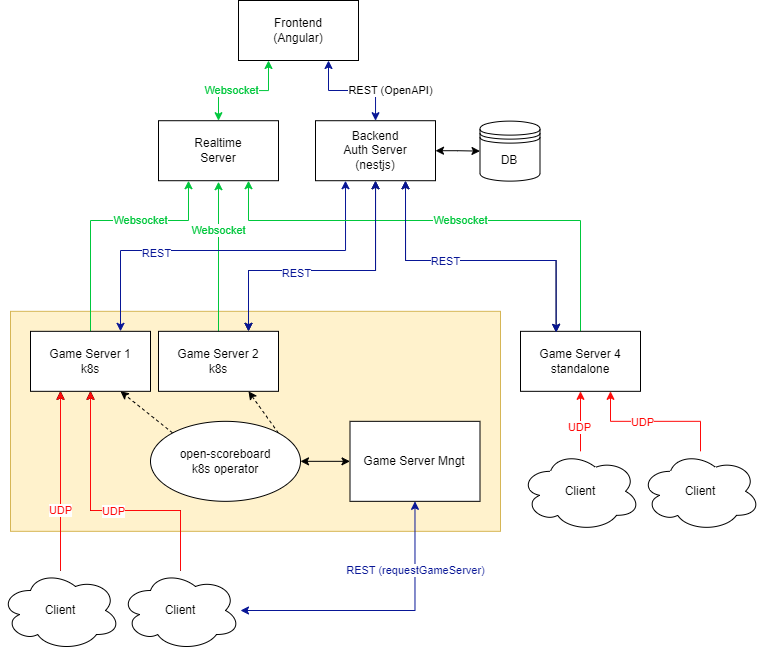

# OpenScoreboard

This project aims to creat a scoreboard for car raging game. Is still in development phase, so dont exept it works.

## TL;DR I wanto to Develop / try it!

```bash
# Pull the repo
git pull https://github.com/gpillon/open-scoreboard/
# Change directory
cd open-scoreboard
# Install Rush
npm install -g @microsoft/rush
# Install the NPM packages:
rush update
```

At this point monorepo is ready. for exaple, to run api:

```bash
# Pull the repo
cd open-scoreboard-api
# Install Rush
npm run start:dev
# Install the NPM packages:
rush update
```

## Its a Monorepo ❤!

Whole application is developed in a Monorepo, all packages composing application are in a single repo.

Folder Structure:

```bash
open-scorboard
├───app
│   ├───open-scoreboard-api
│   ├───open-scoreboard-fe
│   └───...
├───libs
│   ├───lib-1
│   ├───lib-2
│   └───...
└───other stuff
```

## TODO

- [ ] Frontend
    - [x] Init Frontend
    - [ ] Realtime Display
    - [ ] Player history
    - [ ] user login

- [ ] Backend
    - [x] Init Backend
    - [x] Healthcheck Endpoint
    - [x] Game Endpoint
    - [x] Player Endpoint
    - [x] Track Endpoint
    - [x] Lap Endpoint
    - [ ] Auth
    - [ ] Unit testing (?)
    - [ ] integration testing (?)
    - [ ] e2e testing (?)

- [ ] Realtime Server
    - [ ] Init Realtime Server
    - [ ] Healthcheck Endpoint
    - [ ] Unit testing (?)
    - [ ] integration testing (?)
    - [ ] e2e testing (?)

- [ ] k8s
    - [ ] k8s operator
    - [ ] Unit testing (?)
    - [ ] integration testing (?)
    - [ ] e2e testing (?)

- [ ] Game Server Manager
    - [ ] Init Game Server Manager
    - [ ] Healthcheck Endpoint
    - [ ] define `requestGameServer()` endpoint
    - [ ] define `listPublicServers()` endpoint
    - [ ] Unit testing (?)
    - [ ] integration testing (?)
    - [ ] e2e testing (?)

- [ ] Game Server
    - [ ] Define Game Server statuses
    - [ ] Define Integration with Game Server Manager
    - [ ] Unit testing (?)
    - [ ] integration testing (?)
    - [ ] e2e testing (?)

## Architecture


